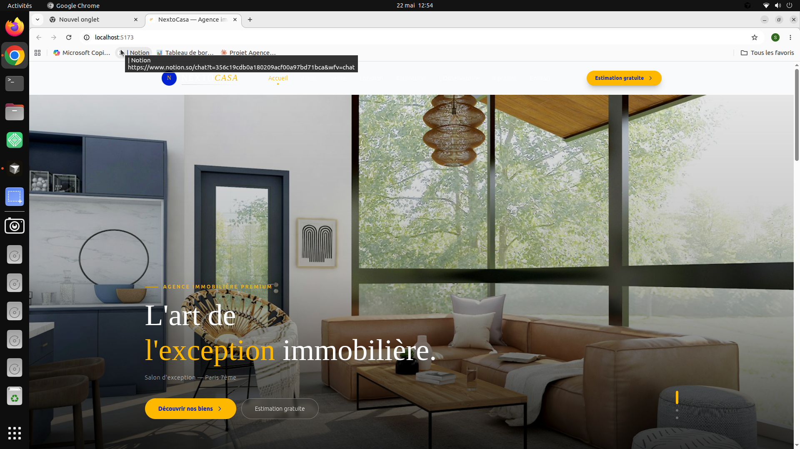
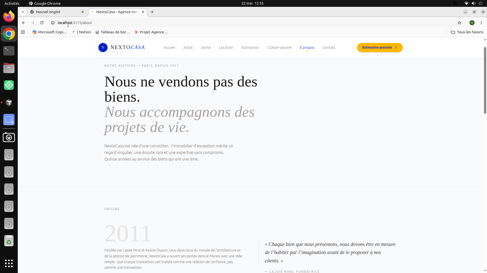
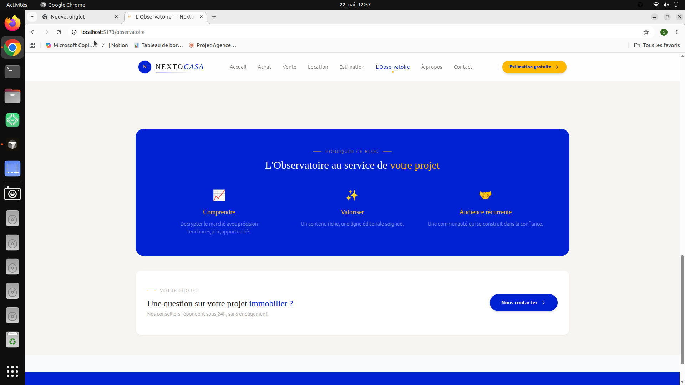

# NextoCasa — Agence immobilière premium



> Site vitrine d'une agence immobilière haut de gamme positionnée sur Paris, Lyon et Bordeaux. Design premium, expérience utilisateur soignée, blog éditorial à haute valeur ajoutée.

**Stack :** React 18 · Vite 5 · Tailwind CSS 3 · JavaScript · React Router v6

---

## Aperçu du projet



NextoCasa est un projet complet de site vitrine immobilier premium, conçu avec une attention particulière portée au design, à la typographie et à l'expérience utilisateur. Il intègre un système de blog éditorial — **L'Observatoire** — destiné à drainer du trafic organique et à installer la crédibilité de l'agence sur son marché.

---

## Pages du site

| Page             | Route                 | Description                                                  |
| ---------------- | --------------------- | ------------------------------------------------------------ |
| Accueil          | `/`                   | Hero carousel, biens en avant-première, services, stats, CTA |
| Achat            | `/achat`              | Liste filtrée avec recherche et tri                          |
| Vente            | `/vente`              | Process en 4 étapes, avantages, double CTA                   |
| Location         | `/location`           | Grille avec slider budget, gestion locative                  |
| Estimation       | `/estimation`         | Formulaire multi-étapes en 3 temps                           |
| L'Observatoire   | `/observatoire`       | Blog éditorial premium (voir ci-dessous)                     |
| Article          | `/observatoire/:slug` | Fiche article avec interlinks                                |
| À propos         | `/about`              | Histoire, philosophie, équipe, chiffres                      |
| Contact          | `/contact`            | Formulaire EmailJS, coordonnées                              |
| Fiche bien       | `/biens/:id`          | Galerie, caractéristiques, conseiller, biens similaires      |
| Mentions légales | `/mentions-legales`   | —                                                            |

---

## L'Observatoire — Blog éditorial premium



L'Observatoire est le cœur éditorial de NextoCasa. Ce n'est pas un blog ordinaire — c'est une publication structurée, pensée pour deux cibles simultanées : les **acheteurs premium** et les **investisseurs patrimoniaux** parisiens.

### Positionnement éditorial

- **Ton** : analytique, nuancé, honnête — style magazine de référence
- **Cible** : acheteurs haut de gamme + investisseurs patrimoniaux, Paris & Île-de-France
- **Rythme** : 1 article toutes les 2 semaines · 26 articles par an
- **Longueur** : articles piliers 2 000–2 500 mots · articles calendrier 1 400–1 800 mots

### Les 3 bénéfices stratégiques

**Trafic SEO** — chaque article est une porte d'entrée supplémentaire sur Google, sans publicité payante. Les articles piliers ciblent des mots-clés à fort volume (« marché immobilier Paris 2025 », « rendement locatif Paris »).

**Image premium** — un blog soigné, rédigé avec rigueur et point de vue assumé, renforce le positionnement haut de gamme de l'agence et installe la confiance avant tout contact commercial.

**Audience récurrente** — des lecteurs qui reviennent régulièrement constituent une communauté engagée, vecteur naturel de bouche à oreille et de recommandations.

### Inventaire des articles (14 articles)

#### Articles piliers (A·) — 6 articles de fond

| Réf. | Titre                                                              | Catégorie      |
| ---- | ------------------------------------------------------------------ | -------------- |
| A·01 | Marché immobilier à Paris en 2025 : état des lieux et perspectives | Marché         |
| A·02 | Acheter un bien de prestige à Paris : les 7 étapes clés            | Achat          |
| A·03 | Rendement locatif à Paris en 2025 : brut, net, net-net             | Investissement |
| A·04 | Quel apport pour acheter dans le 8e, le 16e ou le 17e ?            | Financement    |
| A·05 | SCI ou achat en nom propre : que choisir pour investir à Paris ?   | Juridique      |
| A·06 | Les quartiers de Paris où investir en 2025 : notre sélection       | Marché         |

#### Articles calendrier (S·) — 8 articles thématiques

| Réf. | Titre                                                         | Catégorie      |
| ---- | ------------------------------------------------------------- | -------------- |
| S·01 | Négocier le prix d'un appartement à Paris                     | Achat          |
| S·02 | Fiscalité des revenus locatifs : micro vs réel en 2025        | Juridique      |
| S·03 | Crédit immobilier haut de gamme : ce que les banques évaluent | Financement    |
| S·04 | Colocation haut de gamme à Paris : stratégie méconnue         | Investissement |
| S·05 | Acheter un Haussmannien : les points de vigilance             | Achat          |
| S·06 | Transmission d'un patrimoine immobilier parisien              | Juridique      |
| S·07 | Le 8e arrondissement en 2025 : analyse et opportunités        | Marché         |
| S·08 | LMNP à Paris en 2025 : encore rentable après les réformes ?   | Juridique      |

### Système de publication

Chaque article dispose d'un champ `published` dans `blogContent.js` :

```js
published: true,   // ✅ Visible sur le site
published: false,  // 🔒 Brouillon — invisible pour les visiteurs
```

Pour publier un article, il suffit de passer `published` à `true` et de faire un `git push`. Le site se met à jour automatiquement via Vercel.

### Réseau d'interlinks

Les articles sont interconnectés via le champ `interlinks` — chaque article référence 2 à 3 articles liés, affichés en bas de page dans la section "Pour aller plus loin". Ce maillage interne renforce l'autorité SEO de l'ensemble du site.

---

## Structure du projet

```
nextocasa/
├── public/
│   ├── logo.png               ← Logo de l'agence
│   ├── NextoCasa.png          ← Image hero (si utilisée)
│   └── properties.json        ← Données biens (à alimenter)
├── src/
│   ├── components/
│   │   ├── Navbar.jsx         ← Navigation sticky avec effet scroll
│   │   └── about/
│   │       ├── AboutHero.jsx
│   │       ├── AboutStory.jsx
│   │       ├── AboutPhilosophy.jsx
│   │       ├── AboutTeam.jsx
│   │       ├── AboutStats.jsx
│   │       └── AboutCTA.jsx
│   ├── data/
│   │   ├── aboutContent.js    ← Contenu éditorial page À propos
│   │   └── blogContent.js     ← 14 articles + système published
│   ├── hooks/
│   │   └── useIntersectionReveal.js ← Animations scroll réutilisables
│   ├── pages/
│   │   ├── HomePage.jsx       ← Accueil avec hero carousel
│   │   ├── Achat.jsx
│   │   ├── Vente.jsx
│   │   ├── Location.jsx
│   │   ├── Estimation.jsx
│   │   ├── Blog.jsx           ← Page L'Observatoire
│   │   ├── BlogArticle.jsx    ← Fiche article
│   │   ├── PropertyDetail.jsx
│   │   ├── About.jsx
│   │   ├── Contact.jsx
│   │   └── Legal.jsx
│   ├── App.jsx                ← Router + Navbar + Footer
│   ├── index.css              ← Google Fonts + Tailwind directives
│   └── main.jsx               ← Point d'entrée Vite
├── vercel.json                ← Config routing SPA
├── tailwind.config.js
├── vite.config.js
└── .gitignore
```

---

## Installation & démarrage

```bash
# Cloner le repo
git clone https://github.com/votre-pseudo/nextocasa.git
cd nextocasa

# Installer les dépendances
npm install

# Variables d'environnement (copier et remplir)
cp .env.example .env

# Lancer en développement
npm run dev

# Build de production
npm run build
```

---

## Variables d'environnement

Créez un fichier `.env` à la racine (jamais commité) :

```env
VITE_EMAILJS_SERVICE_ID=votre_service_id
VITE_EMAILJS_TEMPLATE_ID=votre_template_id
VITE_EMAILJS_PUBLIC_KEY=votre_cle_publique
```

---

## Typographie & palette

### Polices (Google Fonts)

- **Cormorant Garamond** — titres, citations, chiffres clés (`font-serif`)
- **DM Sans** — corps de texte, navigation, labels (`font-sans`)

### Palette NextoCasa

| Rôle             | Couleur                                                                     | Valeur      |
| ---------------- | --------------------------------------------------------------------------- | ----------- |
| Bleu principal   |  Bleu NextoCasa | `#0022d2`   |
| Or accent        |  Or NextoCasa   | `#ffb800`   |
| Fond chaud       | Blanc cassé                                                                 | `#f7f5f1`   |
| Texte principal  | Stone 800                                                                   | `stone-800` |
| Texte secondaire | Stone 500                                                                   | `stone-500` |

---

## Dépendances principales

| Package                         | Usage                                 |
| ------------------------------- | ------------------------------------- |
| `react` + `react-dom`           | Framework UI                          |
| `react-router-dom`              | Routing SPA                           |
| `react-helmet-async`            | SEO — balises meta par page           |
| `@emailjs/browser`              | Envoi formulaire contact sans backend |
| `tailwindcss`                   | Styles utilitaires                    |
| `vite` + `@vitejs/plugin-react` | Build tool                            |

---

## Déploiement

Le projet est configuré pour un déploiement sur **Vercel** :

```bash
# Pousser sur GitHub
git add .
git commit -m "feat: mise à jour"
git push origin main
# Vercel redéploie automatiquement
```

Le fichier `vercel.json` gère le routing SPA (toutes les URLs redirigent vers `index.html`).

---

## Crédits & remerciements

### Photographies

Toutes les images utilisées dans ce projet — hero carousel, cards de biens, illustrations d'articles — proviennent de **[Unsplash](https://unsplash.com)**, la plateforme de photographie libre de droits.

Un grand merci à la communauté Unsplash et à tous les photographes qui mettent leur travail à disposition gratuitement. Ces images sont utilisées à titre illustratif dans le cadre de ce projet de démonstration. En production, elles seront remplacées par des photographies propriétaires des biens réels de l'agence.

> **Note** : les images Unsplash sont libres d'utilisation sous la [licence Unsplash](https://unsplash.com/license). Aucune attribution n'est requise, mais elle est vivement encouragée.

### Typographie

- **Cormorant Garamond** par Christian Thalmann — via [Google Fonts](https://fonts.google.com/specimen/Cormorant+Garamond)
- **DM Sans** par Colophon Foundry — via [Google Fonts](https://fonts.google.com/specimen/DM+Sans)

---

## Évolutions prévues

- [ ] Intégration **Sanity.io** (CMS headless) pour la gestion des articles sans toucher au code
- [ ] Connexion au vrai `properties.json` avec les biens réels
- [ ] **Domaine personnalisé** `nextocasa.com`
- [ ] Articles S·09 à S·26 (calendrier éditorial sur 12 mois)
- [ ] Guide PDF premium téléchargeable (monétisation)
- [ ] Newsletter mensuelle (Brevo / Mailchimp)
- [ ] Page Glossaire immobilier (`/glossaire`)

---
## ## 📚 Documentation

- [Stripe - PDF Setup](docs/Stripe-pdf-setup.md)
- [SEO Technique](docs/SEO-technique.md)
- [Intégration Sanity](docs/intégration-sanity.md)
- [Plan LinkedIn](docs/Linkedin-plan-26-posts.md)


_Projet conçu et développé avec soin. © 2025 NextoCasa._
